```{r results='hide'}
library(tidyverse)
```

## Preamble

It is fantastic to be following Mike Miller this year.  Last year, I spent a lot of time
talking about Bayesian inference, and Mike has taken care of many of those topics.  At the same
time, last year I was unsure about the utility of probabilistic genotype calling for RAD-seq data.
My feeling was that one should just be very careful with their RAD preps and get sufficiently high 
read depth data.  My feelings about this have evolved over the last year.  As we will see at the 
end of this session today, there are RAD data sets out there with evidence of very low genotyping
error rates.  Nonetheless, when you break them down by read depth, there is still clear evidence 
that heterozygotes are being missed at lower read depths.  So, really, even the cleanest, most
carefully prepared and curated RAD data sets could benefit from probabilistic genotype calling.

At the same time, there are clearly good reasons to be careful with your RAD preps.  There are
lots of things that can go wrong!  And probabilistic genotype calling might not remedy all of 
those issues.

So, my plan for this session is to pick up from where Mike brought us and focus a little
bit on making inference when multiple levels in a hierarchical Bayesian model are unobserved
(i.e., are in need of being inferred/estimated.)  This will provide us a chance to talk 
more about Markov chain Monte Carlo, which, although it is not employed heavily in 
ANGSD (they tend to maximize the posterior) is an important technique to know about, and 
I use it extensively in estimating genotyping error rates.  We will do this by considering
the problem of jointly estimating the allele frequencies and the genotype frequencies.

First, we'll talk about estimating the allele frequencies alone:

1. Introduce acyclic directed graphs (DAGs)
1. Talk about proportionality to the joint probability (a nice perspective)
1. Show what inference of allele frequencies looks like if you 
   know the genotypes exactly.
1. Talk about how we could learn about the posterior by simulating
   values from it.  Whether they were correlated (MCMC) or not (vanilla 
   Monte Carlo).

After that we will put another layer into the model.  

1. Add in the idea that genotypes are not observed directly, but rather
   underlie counts of reads of different alleles.
1. Show that computing the posterior distribution in this case
   is much more complicated (i.e. MCMC really helps here!)
1. Talk about component-wise MCMC and *Gibbs sampling*
1. Have a little digression into the program *structure* so 
   we can see what Gibbs sampling looks like.

From there we will have the tools necessary to consider another
set of models---ones that use the observed genotype calls to estimate
a type of genotyping error that I call a "heterozygote miscall." In this
case we will

1. Motivate the problem by encountering some plots of expected vs observed
genotype frequencies in RAD seq data that are a little concerning.
1. Develop a simple model to estimate the overall heterozygote miscall rate
and see what that value is for a few data sets.
1. Extend the model to estimate het miscall rate as a function of read depth
and see that even the best of the data sets have moderately high
genotyping error at lower read depths.


After that, the remainder of the session will be spent letting people 
evaluate data sets that they might have laying around in VCF format,
making plots and estimating heterozygote miscall rates using my 
R package `whoa`.


## Bayesian Inference

### Personal Probability

To understand the Bayesian paradigm, it is useful to start with the awareness
that everyone has their own probabilities for events or outcomes, and these 
probabilities are informed by each person's experience, their prior beliefs,
the data that they have access to, and the inferential perspectives or _models_
that they can bring to the task of understanding and incorporating the information that they
have available.

Wait! What kind of crazy notion of probability is this?  Many of us might be 
familiar with the idea of probability being interpretable as the long-run average
frequency of outcomes if a particular event is repeated many times.  But this 
"personal probability" paradigm sounds quite different...

A good way to approach this is with some simple card play.  If I hand out
cards from a shuffled deck to five people in the room and tell them not to 
look at the cards, and then ask everyone what the probability is that the 
next card on the deck is the ace of spades, most everyone will have the 
same probability for that.  But if we let the 5 people look at their cards 
and then ask each, in turn, what they now think is the probability that the
top card is the ace of spades, they will likely update their beliefs based
on the card that they possess, as well as the responses of any cardholders
before them.

There a lot of assumptions that go into these calculations.  What are they?

At any rate, it is easy to see that people have different probabilities for the
top card being an ace of spades depending on how much information they have.

### Probability as a "Measuring Stick" for Uncertainty

A big switch being made here is that we are now using probability as a way 
of expressing or measuring each person's "uncertainty" about an event.  This
is quite a departure from thinking about probability only as a property that
can be discussed in connection with events that we can envision happening
multiple time (so that we might derive a notion of probability as the average
frequency of occurrence over very many trials.)

This interpretation of probability is considerably more flexible than the
"frequentist" interpretation, and it is also already familiar to most of us:
we are already quite comfortable with being told that the probability it is 
going to rain today is 30%, even though there will only ever be one today. With 
probability as a measure of uncertainty, you can use probabilities to talk about
things that will only happen once. What is the probability that:

- there will be three more category 5 hurricanes this season?
- the Republicans in Congress will succeed in repealing Obamacare before Sept 30, 2017?

Not only that, but now we can use probability to make statements about how
uncertain we are about things that are deterministic.  For example:

* What is your probability that Monrovia is the capital of Liberia? 

So, if we are trying to measure:

- height, then we use centimeters,
- mass, then we use kilograms,
- electrical resistance, we use Ohms
- uncertainty?...we use probability...

### An interesting digression

Probability as a field of mathematical study did not necessarily "grow up" with the
intent to be a way to measure uncertainty.  (It partly grew out of contemplation
of "Borel subsets" and many much more esoteric concepts.) But the way that
it was developed as a mathematical construct turns out to be precisely what 
is required if we desired to extend the system of logic in which 1 means
"absolutely true" and 0 means "absolutely false" to a logical system in which
there could be degrees of uncertainly between 0 and 1.


### Updating Beliefs

A characteristic feature that we saw playing our card game is that when new
information arrives, people update their beliefs, and hence they update
their degree of undertainty (their probabilites...).

Clearly, if we want to be Bayesians and use probability to express uncertainty
about things, we need a coherent, reasonable way to update our beliefs.  This is
done using basic principles from probability, which were described (for inferential
purposes) by the Reverend Thomas Bayes (born 1702), and is hence known as 
Bayes' Law, or Bayes Theorem.  

Bayes Theorem is typically expressed in an equation that probably feels
pretty opaque to most people (it certainly did to me when I was a young
biology graduate student.)  I remembered seeing it something like this:
suppose that you have observed some data $D$, and that you have $k$ different
hypotheses for its occurrence, and for each hypothesis, $i$,  you can compute
$P(D|H_i)$ the probability of observing D given that hypothesis $i$ is true.

The posterior probability of a certain hypothesis $H_i$ given $D$ is then:
$$
P(H_i|D) = \frac{P(D|H_i)P(H_i)}{\sum_{j = 1}^k P(D|H_j)P(H_j)}
$$
Yack!  Let's see if we can find an easier way to talk about this!

We will (at least I hope it will be easier) and we will do so while talking
about a simple problem that we can build upon to make more complex models:
estimating the frequency of an allele in a population.

### A Simple Conditional Probability and DAGs

Almost all of the probabilities that we talk about routinely are
_conditional probabilities_.  That is, they are probabilities that are
expressed conditional on some other variable or thing taking a certain value. 

Here we will start beating to death an example that involves genotype and 
allele frequencies, but bear with us, because we will end up using what we
learn from this example---and building upon it---throughout this
lecture. 

If we ask about the probability that an individual is homozygous
for the $A$ allele, we might first have to make an assumption that the population
is in Hardy-Weinberg equilibrium, and then we also need to assess this probability
_conditional on_ the frequency of the $A$ allele being $p_A$ in the population.

So, we could write:
$$
P(\mbox{Individual is AA}~|~p_A) = p_A^2
$$
If we knew the value of $p_A$, then it would be easy to do this calculation.  This is
an example of probability "running forward".  We will see later that when
we want to do inference we need to "run probability backward" (which is what 
Bayes' Theorem lets us do.) 

Recall that HWE means that the allelic type of the two gene copies carried in 
an individual are conditionally independent given the allele frequency.  Hence, 
the probability of drawing the first gene copy as an A is $p_A$, and the probability
that the second gene copy is drawn as an A (given that the first was an $A$), is also $p_A$.
So the probability that the individual is $AA$ is the product of those: $p_A^2$.

We can draw a diagram of that called an acyclic directed graph (or DAG).  These are
very helpful for visualizing models as they become more complex.  

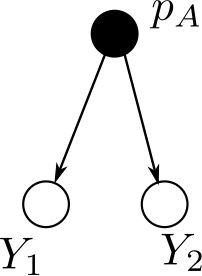

The key thing to know about DAGs is that they express the factorization of 
the joint probability of the variables into a product of conditional
probabilities. (Specifically a product over nodes of the probability of
each node conditional on its parents.)  

From the way 
the DAG is drawn above, it is clear that we can say:
$$
P(\mbox{Individual is AA}~|~p_A) = P(Y_1 = A~|~p_A) P(Y_2 = A~|~p_A) = p_A \cdot p_A =  p_A^2
$$

Here is a quick summary of DAGs:

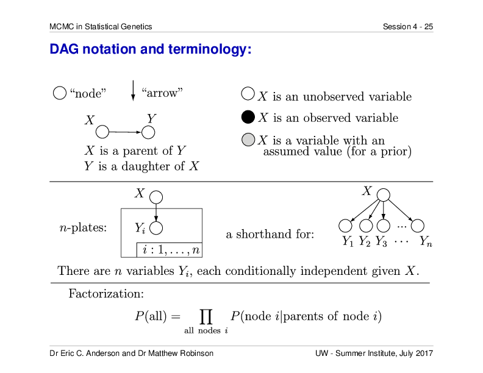


### A Picture of Inference of Allele Frequencies From a Sample of Genotypes

The previous discussion assumed that the allele frequency was known, and we wanted
to compute the probability of an individual's (unknown) genotype.  For that exercise,
we were running from an observed node in the graph ($p_A$) to two unobserved ones.  This 
is a straightforward calculation of probabilities.

Much of the time in science, we are able to observe the variables at the end of the 
arrows in a DAG, and we want to make inferences about the variables that are "upstream"
of them in a DAG. For an example, let us consider the situation in which we sample $N$
diploids and observe their genotypes, and from that we want to infer the allele frequency
$p_A$.  

The DAG for this situation looks like this:

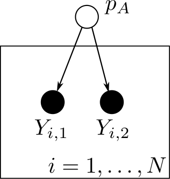

From which it is immediately apparent that the probability of all the 
data, say $\boldsymbol{Y} = (Y_{1,1}, Y_{1,2}, Y_{2,1}, \ldots, Y_{N,1}, Y_{N,2})$
is just a simple product of Bernoulli random variables:
$$
P(\boldsymbol{Y}~|~p_A) = \prod_{i=1}^N P(Y_{i,1}~|~p_A)P(Y_{i,2}~|~p_A) 
$$
In fact, if we define each $Y$ to be 0 or 1 as follows:
$$
\begin{align}
Y = 0 & ~~~~~\mbox{with probability} ~~~ 1 - p_A & ~~\mbox{(i.e., it's an}~a) \\
Y = 1 & ~~~~~\mbox{with probability} ~~~ p_A & ~~\mbox{(i.e., it's an}~A)
\end{align}
$$
Then it is not too hard to see that
$$
P(\boldsymbol{Y}~|~p_A) = p_A^{\sum Y_{i,j}} (1- p_A)^{2N - \sum Y_{i,j}}
$$
This is a probability function.  But if you consider this as a function of $p_A$ with 
$\boldsymbol{Y}$ considered as fixed, then it is often referred to as the 
_likelihood function_.


### Methods of Inference

We see that we are trying to learn something (make inference) about 
$p_A$ (an unshaded/unobserved variable) that is upstream of our observed
data.  This is inference.  

To put some concrete numbers on this.  Let's say that $N = 100$ diploids, and 
out of the 200 gene copies, 73 of them were $A$ alleles.

There are lots of ways that you might do inference.  Here are a few:

- _Method of the Eyeball_: Look at your sample and surmise that the fraction of A alleles
in the sample is a good estimate of the fraction of $A$ alleles in the population.
- _Method of Moments_: This formalizes the "Method of the Eyeball" by equating the sample mean
with the population mean.
- _Method of Maximum Likelihood_: Find the value of $p_A$ that maximizes the probability of
observing your sample.  In other words, consider the probability
$P(\boldsymbol{Y}~|~p_A)$ as a function of $p_A$, where the data,
$\boldsymbol{Y}$, are fixed, and then find the value of $p_A$ that maximises that _likelihood_ 
function.

All of those methods give you a _point estimate_ for $p_A$.  An alternative to
these methods is to be Bayesian and find the _posterior distribution_ for $p_A$
conditional on the data, $\boldsymbol{Y}$. 

Before we do this, we are going to want to review a view simple facts about
marginal, conditional, and joint probabilities.

### Some important probability rules

If you have two different events $A$ (no relation, necessarily, to the big-A allele ) and $B$,
and we use $A$ and $B$ to refer to the outcome of each, then here are some things
that are always true:

- $P(A)$ and $P(B)$ are referred to as marginal probabilities.
- The joint probability of $A$ and $B$ is the probability that those two outcomes
occurred, and it can be computed as the product of a marginal probability and a conditional
probability, in two different ways:
$$
P(A,B) = P(A)P(B~|~A) = P(B)P(A~|~B)
$$
- This means that conditional probabilities can be computed from the joint probability:
$$
P(A~|~B) = \frac{P(A,B)}{P(B)}~~~~~~~~~~~~~~~~~~~~~~~~
P(B~|~A) = \frac{P(A,B)}{P(A)}
$$

And that leads us to an expression for Bayes Theorem that I find easier to grok out:
$$
P(A~|~B) \propto P(A, B)
$$
where we are thinking of $P(A|B)$ as a function of $A$ with $B$ fixed.  It is typically
easy to compute the joint probability, $P(A,B)$, and then you just have to remember that
$P(A~|~B)$, since it is a probability on $A$, must sum to one over all possible values of $A$.

The same is true for:
$$
P(B~|~A) \propto P(A, B)
$$

### Bayesian Inference for $p_A$

Back to our simple example.  If we want to do Bayesian inference for $p_A$ we 
see that we will want to compute the _posterior probability_:
$$
P(p_A|\boldsymbol{Y})
$$
which  we now know is going to be proportional to the _joint probability_:
$$
P(p_A,\boldsymbol{Y})
$$
and what we currently have at our disposal is the _likelihood_:
$$
P(\boldsymbol{Y}~|~p_A)
$$
We could get the joint probability by using the likelihood in the product:
$$
P(p_A,\boldsymbol{Y}) = P(\boldsymbol{Y}~|~p_A) P(p_A)
$$
But what is this $P(p_A)$?!

It is the _prior distribution_ for $p_A$.  It is a
necessary ingredient to be able to use the likelihood to compute the
joint probability (and, hence, the posterior probability), and we envision
it as a probability distribution that
expresses our degree of belief about $p_A$ _before we look at the data_.

Note that this all boils down verbally to: **The posterior distribution is 
proportional to the prior times the likelihood**. 


### A family of priors for $p_A$

Since $p_A$ is a proportion, an obvious choice for prior would
be a beta distribution.  The beta distribution gives a continuous prior
distribution on a value that is between 0 and 1.  It has two parameters,
often called $\alpha_1$ and $\alpha_2$.  Here are some examples:
```{r, echo=FALSE, message=FALSE}
library(tidyverse)
xs <- seq(0,1, by = 0.001)
atib <- list(
  `a1 = 1/10;  a2 = 1/10` = tibble(p_A = xs, density = dbeta(xs, 0.1, 0.1)),
  `a1 = 1/2;  a2 = 1/2` = tibble(p_A = xs, density = dbeta(xs, 0.5, 0.5)),
  `a1 = 1;  a2 = 1` = tibble(p_A = xs, density = dbeta(xs, 1, 1)),
  `a1 = 5;  a2 = 5` = tibble(p_A = xs, density = dbeta(xs, 5, 5)),
  `a1 = 10;  a2 = 2` = tibble(p_A = xs, density = dbeta(xs, 10, 2))
) %>%
  bind_rows(.id = "parameters")

g <- ggplot(atib, aes(x = p_A, y = density, colour = parameters)) +
  geom_line() +
  ylim(0, 4.3)


ggsave(g, filename = "figures/beta_densities.pdf", width = 7, height = 5)

g
```

The beta density for a random variable $X$ has the form:
$$
p(x | \alpha_1, \alpha_2) = \frac{\Gamma(\alpha_1 + \alpha_2)}{\Gamma(\alpha_1)\Gamma(\alpha_2)}
x^{\alpha_1 - 1}(1-x)^{\alpha_2 - 1}
$$
The part that looks hairy is a few Gamma functions.  Don't worry about those---it
is a constant.  The important part (the "kernel", as they say...) is:
$$
x^{\alpha_1 - 1}(1-x)^{\alpha_2 - 1}
$$
Or, if we wanted this to a be a prior on $p_A$, the prior would be proportional to:
$$
{p_A}^{\alpha_1 - 1}(1-p_A)^{\alpha_2 - 1}
$$
And, if we wanted to be even more specific, we could choose $\alpha_1 = \alpha_2 = 1$ to
give ourselves a uniform prior which is proportional to 1:
$$
P(p_A) \propto {p_A}^{1 - 1}(1-p_A)^{1 - 1} = {p_A}^{0}(1-p_A)^{0} = 1
$$


### A Graphical Aside

Just wanting to point out that if you want to be a Bayesian, you 
can't have any unobserved nodes on your DAG that don't have any parents.
Those priors that you use/accept/assume are always the uppermost nodes
in a DAG.  I usually use gray nodes to denote them. For example, here is the
DAG for the Bayesian version of the previously shown DAG:

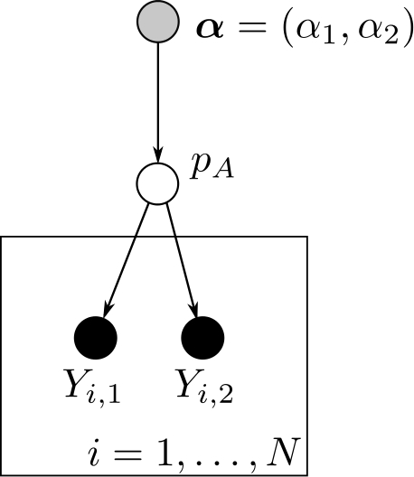


### The posterior for $p_A$

Now that we have a choice for our prior, $P(p_A)$, we can easily find something that
is proportional to the posterior distribution.  What is proportional to the posterior
distribution? Remember, **The posterior distribution is 
proportional to the prior times the likelihood** (which, don't forget, is the
_joint_ probability).  Remember that the likelihood looks like:
$$
P(\boldsymbol{Y}~|~p_A) = p_A^{\sum Y_{i,j}} (1- p_A)^{2N - \sum Y_{i,j}}
$$
And, in our example, the number of $A$ alleles is 73 (out of 200), so
$\sum Y_{i,j} = 73$ and $2N - \sum Y_{i,j} =  127$.

Since we are only going to worry about finding something that the
posterior probability is proportional to, we can drop any constants and 
we get this for the prior times the likelihood:
$$
\begin{align}
P(p_A~|~\boldsymbol{Y}) &\propto {p_A}^{0}(1-p_A)^{0} \times p_A^{73}(1-p_A)^{127} \\
  & \propto p_A^{73}(1-p_A)^{127} \\
  & \propto p_A^{74 - 1}(1-p_A)^{128 - 1} \\
\end{align}
$$
which is precisely the kernel of a beta distribution with parameters 
74 and 128.  

Aha! So, the posterior here is a beta distribution with $\alpha_1 = 74$
and $\alpha_2 = 128$.  We can plot that if we want:
```{r, echo=FALSE, message=FALSE}
xs <- seq(0, 1, by = 0.001)
btib <- tibble(p_A = xs,
               density = dbeta(xs, 74, 128))
g <- ggplot(btib, aes(x = p_A, y = density)) +
  geom_line() +
  ggtitle("Posterior Distribution of p_A")


ggsave(g, filename = "figures/pa_posterior.pdf", width = 7, height = 5)

g
```

### To the Bayesian, the posterior distribution is everything

To the Bayesian, the posterior distribution contains all the information
that the data has about the parameter to be estimated---in this case, $p_A$.
And, the full posterior distribution, unsummarized, expresses that all that information
as fully as can be done.  

However, sometimes you don't want to carry around a full posterior distribution, 
especially if it is a distribution on multiple variables (multidimensional).

Often you will want to summarise the posterior distribution.

### Some standard ways of summarizing the posterior

1. The posterior mean.  Gives a point estimate that minimizes squared error posterior loss.
2. The posterior median.  Gives a point estimate that minimizes absolute posterior loss.
3. The posterior mode. Gives a point estimate that minimizes 0-1 posterior loss.
4. The Bayesian Credible Interval: provides an interval estimator. Like a confidence interval, but infinitely easier to intepret correctly...


## Monte Carlo and Markov Chain Monte Carlo

In the above segment, we obtained a posterior distribution analytically.  That
is not the way things typically work out.  It is more common that
one is not able to obtain the posterior analytically, but, rather, can only
obtain a _sample_ from the posterior distribution.  With a sample from the posterior,
however, it is possible to use Monte Carlo to approximate virtually any quantity
that might be of interest.  Let's look at that with our simple example.

### A "vanilla" Monte Carlo sample from the posterior for $p_A$ 

Even though we can compute the posterior analytically, it can still
be convenient to obtain a sample from it.  We can sample 1 million values
from the posterior for $p_A$ like this:
```{r}
pA <- rbeta(n = 10^6, 74, 128)
```
The first 10 values of that sample look like:
```{r}
pA[1:10]
```

We call this is a "vanilla" Monte Carlo sample because every member of the sample
was independent---this is not _Markov chain_ Monte Carlo.

If we wanted to use the sample to approximate the full posterior, we could do 
that with a histogram:
```{r}
hist(pA, breaks = 100)
```

Let's watch this in action:  **COMPUTER DEMO beta_dens**

If we want the posterior mean, that is easy, too:
```{r}
mean(pA)
```
as is the posterior median:
```{r}
median(pA)
```
Or the standard deviation of the posterior distribution:
```{r}
sd(pA)
```
Or, the 90%-equal-tail Credible Interval
```{r}
quantile(pA, probs = c(0.05, 0.95))
```
All of those quantities could have been obtained analytically in this case,
but it is a lot simpler to just work with a Monte Carlo sample because the 
operations are the same with every Monte Carlo sample (which is not necessarily
true of every analytical distribution...).

### Transformations are simple with a Monte Carlo sample

Imagine for a moment that what you really wanted to estimate was the 
probability that, if you sampled three individuals, in sequence, from the population,
the first one would be homozygous $AA$, the second one would be heterozygous $Aa$
and the third one would be homozygous $aa$. Since we are being Bayesians here, 
we will want to compute the posterior distribution of that probability given the 
observed data.  This is something that would be quite messy to do analytically,
but it is easy to use the Monte Carlo sample to do it.  Clearly, for a given $p_A$, 
the probability of the sequence ($AA$, $Aa$, $aa$) is
$p_A^2\times 2 p_A (1-p_A) \times (1-p)^2$.  So, the posterior distribution of that
quantity is simply: 
```{r}
three_geno_seq_posterior <- pA^2 * 2 * pA * (1 - pA) * (1 - pA)^2
```
And we can look at it:
```{r}
hist(three_geno_seq_posterior, breaks = 100)
```


### What is the Markov Chain part of MCMC?

We've seent that Monte Carlo in this Bayesian context is all about basing
one's inference on a _samples_ from the posterior distribution.  However, it turns
out that you often can't obtain _independent_ samples from posterior.  In high dimensions
that is just not possible.  But, it _is_ possible to construct an ergodic Markov chain that
has as its limiting distribution the posterior distribution you want to be sampling from.

What?!

OK, we will talk briefly about Markov chains.  Basically a Markov chain is a
stochastic process (like a random walk) in which the probability of ending up 
in some place after the next step depends only on where it currently is---not
on how it got there...

A classic example is a random walk, we will consider one with scattering boundaries:

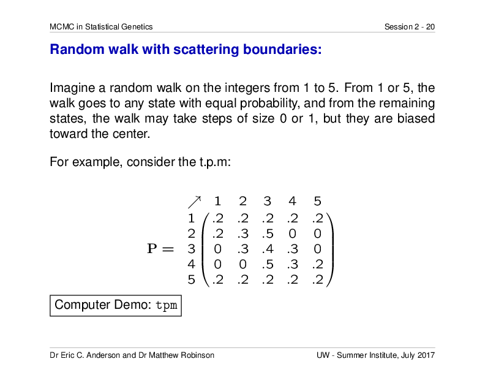

The important take-home message from the `tpm` Computer Demo is that if you run a Markov chain
long enough, it spends time in different states with a predictable pattern called the 
limiting distribution.  In other words, you can take a sample of the states visited by the
chain and use that as a Monte Carlo sample.  That is Markov chain Monte Carlo.

### Let's see what it looks like for $p_A$

Computer Demo beta_dens with MCMC.

### Why MCMC is so great for Bayesians

Via MCMC, it is possible to obtain samples from the posterior distribution
even if the posterior distribution is highly-multidimensional and complicated.

There are two main reasons for this:

1. A Markov chain can be devised to sample from the posterior distribution
without knowing the normalizing constant.  In other words, if you can compute the
joint probability (prior times likelihood) for a fully-observed version of your model,
that is all you need. (Note that you can pretty much always compute the joint probability 
for a fully-observed model.)
2. The Markov chain so devised can be constructed by proposing changes only to small
parts of the model, which makes it possible to break down complex distributions in
ways that make it manageable to sample from them.

The details of this are beyond the scope of a 1.25 hour lecture.

### Why MCMC can be not-so-great

1. It can be computationally expensive and take a long time.
2. It can mix poorly, i.e. it might not sample reliably from all areas
of the distribution in proportion to (or even approximately in proportion to) their
posterior probability.
3. It can appear to be mixing well, but actually not be mixing well.  It is important to
perform multiple runs from different starting values to assess convergence.
4. Especially in "canned packages" it can let you do "black-boxy" inference in models that are 
so complicated that it is hard to have proper intuition about how they behave or perform given
the vararies of your own data.

Again, these topics are beyond the scope of this presentation.  But grab me sometime during the week if you want to talk about it.


## Probabilistic Genotype Calling / Allele frequency estimation {#probcall}

We are now going to expand our allele frequency model just a little bit, to get a taste for 
how we might infer both allele frequencies and genotypes given short read data.

Let's consider this setup: we are trying to infer genotypes in individuals and estimate
the allele frequencies in a population at a SNP in which the variants are the two
different bases,  $C$ or $T$.  We know where the SNP occurs (we are disregarding the problem
of inferring whether a SNP is there) but we do not know its frequency in the population.
We have sequenced $N$ individuals at this SNP.  We don't know the genotype of any of these
individuals, but we get to observe the number of sequencing reads on each individual, $i$,
that contain a $C$, and the number of reads that contain a $T$ at the site.  We call that
observed variable $\boldsymbol{R}_i = (R_{i,C}, R_{i,T})$, a two-vector.  We include in our model 
a sequencing error rate $\mu$ which, for simplicity here, we will assume is known.
With probability $\mu$ a read from a chromosome that really contains a $C$ at the site will
report a $T$, while with probability $1 - \mu$ the base at the site is correctly reported as a $C$.  Similarly for chromosomes that contain a $T$ at the site, with probability $\mu$ a read
will report a $C$ and with probability $1 - \mu$ it will correctly report a $T$.  

Here is a DAG for the model:

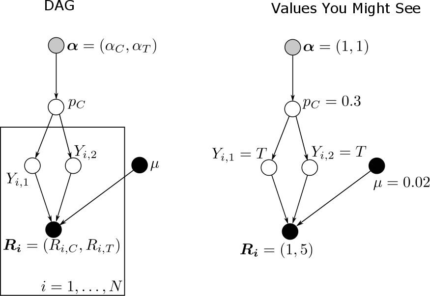

  
  
All right.  This is fun.  Now there are _two_ layers of unknown variables (the $Y$'s and $p_C$ 
that we will try to infer together, at the same time).


### Conditional probabilities in the model

Most of these we have seen before:

- $P(p_C | \alpha_C, \alpha_T)$ is just a beta prior on $p_C$.
- $Y_{i,1}$ is a Bernoulli trial with success probability (i.e. probability of
getting a $C$ of $p_C$.)
- The only new one is the probability distribution of read counts given the genotype and
the genotyping error rate: $P(\boldsymbol{R}_i~|~Y_{i,1}, Y_{i,2}, \mu)$

### The conditional probability $P(\boldsymbol{R}_i~|~Y_{i,1}, Y_{i,2}, \mu)$

This thing turns out to be pretty easy.  It can be broken down into cases:

1. **$i$ is homozygous for $C$ (i.e., $Y_{i,1} = Y_{i,2} = C$):** In this case,
the only way to get a read with a $T$ at the site is by a sequencing error, which 
happens with probability $\mu$.  Thus, it is akin to drawing $M = R_{i,C} + R_{i,T}$
balls out of an urn (with replacement), a fraction $\mu$ of which
say $T$ on them, the rest which say
$C$ on them.  In such a case $R_{i,C}$ is binomially distributed, $M$ draws with
success probability $1-\mu$.
2. **$i$ is homozygous for $T$ (i.e., $Y_{i,1} = Y_{i,2} = T$):** Same argument
as above, $R_{i,C}$ is binomially distributed, $M$ draws with
success probability $\mu$ this time, rather than $\mu$.
3. **$i$ is homozygous for $T$ (i.e., $(Y_{i,1} = C, Y_{i,2} = T)$
or $(Y_{i,1} = T, Y_{i,2} = C)$):**  Because we have assumed sequencing error rates
are symmetrical between different bases, this is easily figured out---the reads are
like balls you are sampling (with replacement) from an Urn in which half of the balls 
are $T$'s and half of them are $C$'s.

### A little flavor of how MCMC proceeds

The unobserved genotypes of the individuals in the above model are what are sometimes
called "missing data".  They are not missing data in the sense of small holes in your
data set that resulted from some data-collection failure.  They are missing in the sense
of "What is missing here is something that would make this whole problem easier".  Clearly,
as we showed in an earlier section, if we knew these genotypes exactly, doing Bayesian
inference for $p_C$ is pretty darn easy.  

Another name for this "missing data" is "latent variables."  Many formulations of MCMC 
are developed with these types of latent variables.  In our case, a brief sketch of how 
MCMC would proceed starts with a bit of wishful thinking.  We say, "Wouldn't it be great if
we actually knew the value of $p_C$...Hey! We don't, but let's just start with a guess and 
pretend it is true."  So, we would start by initializing the model and setting $p_C$ to some 
random value, let us call that value $p_C^{(0)}$.

Now, if we know the value of $p_C$, then the only thing that would be left unknown in the model
would be the genotypes of the individuals.  But looking at the graph it is clear that they 
are all conditionally indendent given $p_C^{(0)}$ and the the observed read depths.  So, 
pretending that $p_C^{(0)}$ is the truth, we could compute, for each individual $i, the 
posterior probabilities of $i$'s genotype (the three cases, 1--3 above). (By the way, this 
distribution is often called the "full conditional distribution").  

Then we would simulate values of the genotypes from those posterior distributions.  Aha!
once we have those simulated, we can pretend that they are real and use them to 
come up with a new estimate of $p_C$ by compute the posterior distribution (full conditional)
for $p_C$ given the current values of the genotypes and then simulating a value from
that distribution.  Call that $p_C^{(1)}$, and then go back to simulating new values for the
genotypes.  

Doing that over and over again creates a Markov chain that does a random walk 
over the space of all possible genotypes of the $i$ individuals and the unknown
allele frequency $p_C$, with the amount of time the chain spends in any state being 
_proportional to the posterior probability of that state!_.


### Some of the assumptions in the above model...

There are quite a few but the biggest is that each read is independent of the others.
That assumption would be violated if:

- the sequences upon which the $C$ (or the $T$) occurred were somehow subject to
greater amplification during any PCR steps, or were more likely to attach to
"the lawn" on an Illumina machine.
- there are PCR duplicates.  This can be a really big issue for RAD methods that
don't have a good mechanism for filtering PCR duplicates.


### Why is this a good idea?

Because the allele frequency estimate is there to inform the inference of genotypes.

If the frequency of the $C$ allele is quite low, that will provide a lot of
evidence in the model against inferring someone to be homozygous for the $C$ allele.

And this would be a good thing, because after a little bit of looking at published
data sets of genotypes called by traditional means (i.e. apparently without
considering allele frequencies), it appears there is a bit of an epidemic
of genotyping error in RAD sequenced data.


## Estimating Genotyping Error Rates in some RAD datasets

I became interested in widespread departures from Hardy-Weinberg equilibrium
in called genotypes from RAD seq data, and investigated it a little bit.

**It is important to recognize in this section that we are dealing only with
called genotypes and have not retained any of the read depth information, etc.
We are just looking at called genotypes! **

### Looking at Willow Flycatchers

My wife, Kristen Ruegg, does a lot of RAD seq on birds.  She is a stickler for 
high-quality DNA and high read depths, and she works with some very good technicians
at UCLA.  Below is a plot I made of some of her (as yet unpublished)
data from Willow Flycatchers.  They
called 105,000 SNPs in almost 200 individuals, and shown here are 47 individuals from the
imperiled population of the _extimus_ subspecies in Arizona. It is a plot of 
the expected frequency of each genotype  (0 = homozygous for the reference allele, 
1 = heterozygote, 2 = homozygous for the alternate allele) on the $x$-axis against the 
observed frequency of each genotype, across all loci polymorphic amongst those 47
individuals.

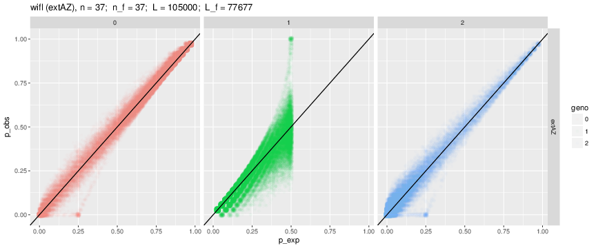

These data were obtained by alignment to a de-novo assembled genome with SNPs calling
using GATK, with light filtering (read depths > 6 or 10, and Phred-scaled
genotype likelihoods > 30, I think).

Note numbers up there: 

- **n** is the number of individuals in the population.
- **n_f** is the number left after tossing out anyone with more than 90% missing data.
- **L** is the number of loci in the whole data set.
- **L_f** is the number of loci remaining after removing those that are monomorphic in the
focal population, or which are missing data from more than 70% of the individuals.


It looks reasonably good---you want the observed to fall along the expected line---apart
from some obvious outliers that are all heterozygotes: clearly more than one genomic region
aligning to the same spot in the assembled genome.

### What should these plots look like?

It is easy to see what these plots should look like under Hardy-Weinberg equilibrium
by simulating it.  Here are results of simulations with sample sizes of 
20 and 40 individuals.

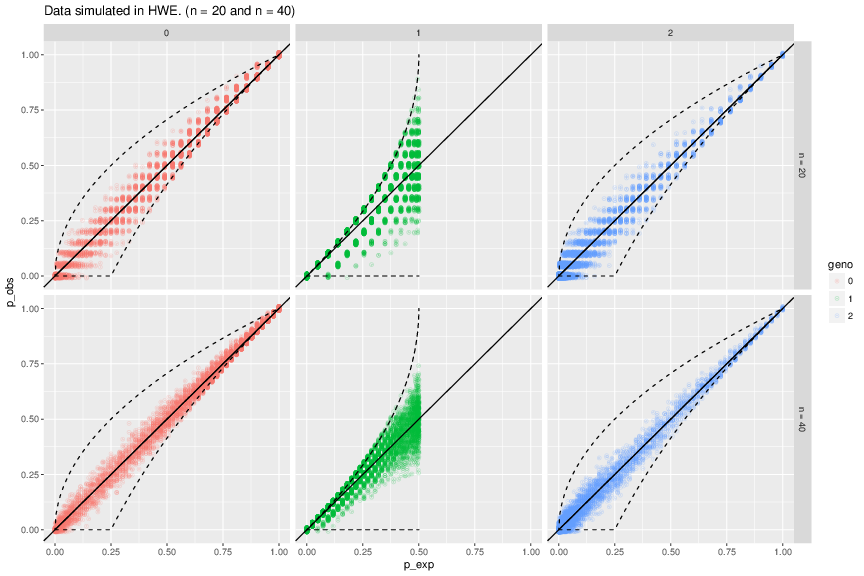

Also, if you do a little thinking and some algebra you can see that, because
the expected genotype frequencies are computed from the allele frequencies 
estimated from the observed genotypes, there are some bounds on where the
points can go.  Those are indicated by dashed lines above.

### What about some published data sets?

I went through Molecular Ecology and Dryad and found about 12 data sets created by some
version of RAD (RAD, RAD-PE, ddRAD, etc.) that were in a format that was not
too hard to wrangle into an 012 matrix.  For each data set, I focused on the 
single sampling location with the largest sample size and made similar plots for
them.  Here are two:

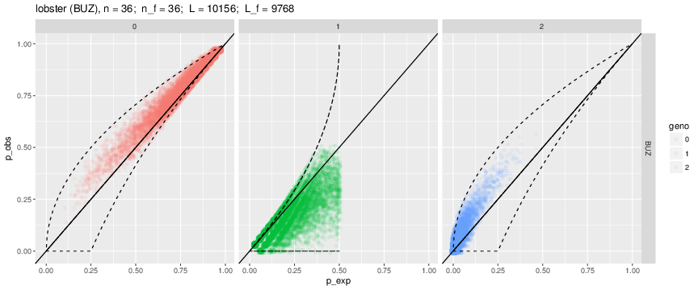

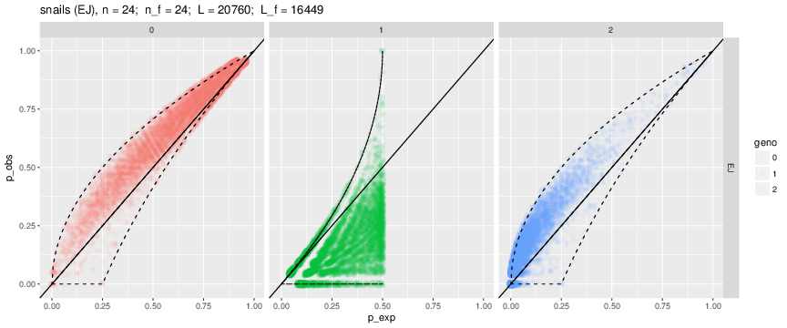

Wow! Those are some data sets that are, in the aggregate, showing severe
departures from Hardy-Weinberg equilibrium.  

I think in one of them the authors
said that they filtered out loci that were significantly out of HWE.  So, it might
be that with small samples, and focusing only on a single marker at a time, it is 
hard to detect these distortions.  But they are quite evident when viewed like this.
The main point: there are far more homozygotes than you would expect under HWE.

### A Simple Model of Genotyping Errors

When I look at these pictures, I think, "Let's make a super simple model of genotyping
error and estimate what the genotyping error rates must be to get things that look
this distorted."

Obviously, there are some heterozygotes that are being called as homozygotes. So,
let's propose this: all individuals that are truly homozygotes get correctly called
as homozygotes, but individuals that are truly heterozygous have a probability $m$ of
being miscalled as a homozygote.  If the individual is miscalled, then it has an equal
chance of being called as either homozygote. 

We can draw a DAG for this model, but let's establish a convention, first: rather than
naming alleles by the bases that they carry, we will just let the alleles be
labelled 0 and 1.  Then the possible genotypes, $G$ are denoted 0, 1, or 2, according to
the number of 1 alleles in the diploid genotype.

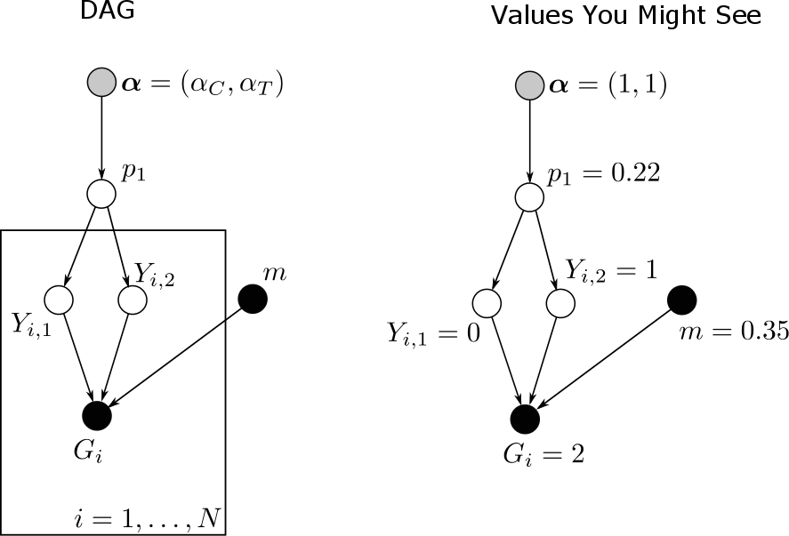

$p_1$ is the frequency of the "1" allele.  

We don't have time to go over the details of the model, but they are straightforward
and trivial.  It takes just a few lines of R code to implement MCMC for it. It mixes
well, and even on large data sets it doesn't take too long to get an estimate of that
_heterozygote miscall rate_ parameter $m$.  

### A Gallery of Data sets

Here are all the data sets I investigated, ordered by $m$ from smallest to largest.

#### bonnethead_shark,  $m = 0.01$

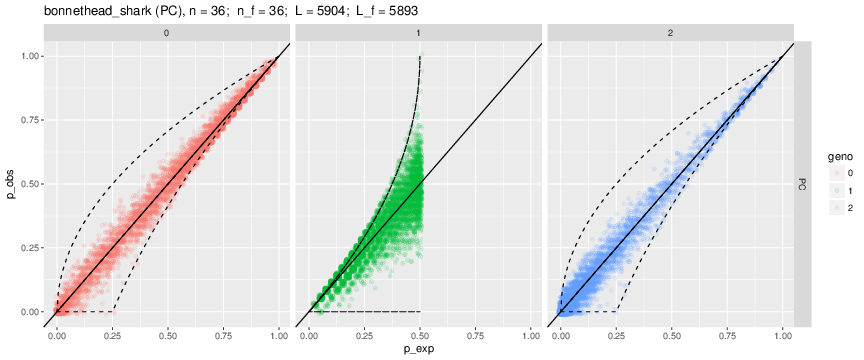


#### wak_chinook,  $m = 0.02$

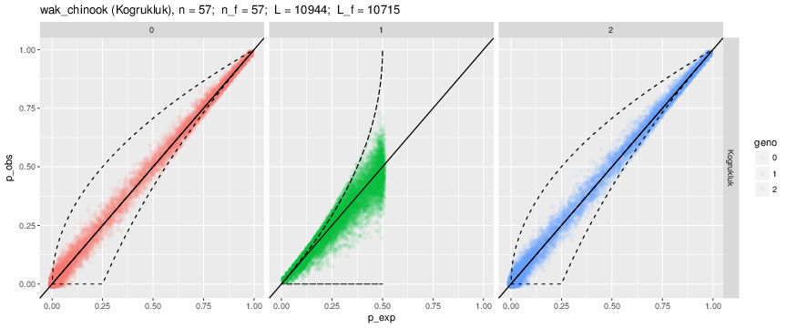


#### wifl,  $m = 0.03$

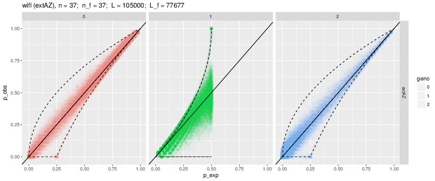


#### red_drum,  $m = 0.05$

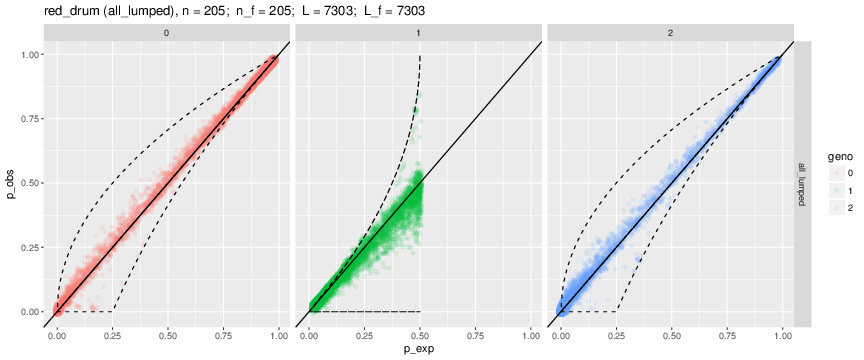


#### anguilla,  $m = 0.14$


#### chinook_hecht,  $m = 0.17$

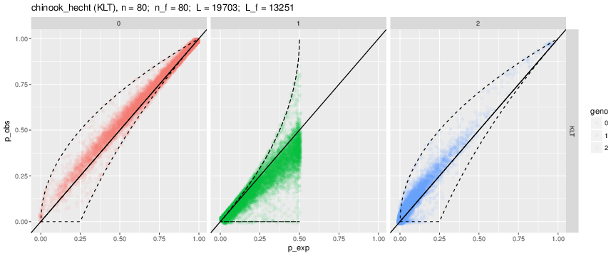


#### rostrata,  $m = 0.23$

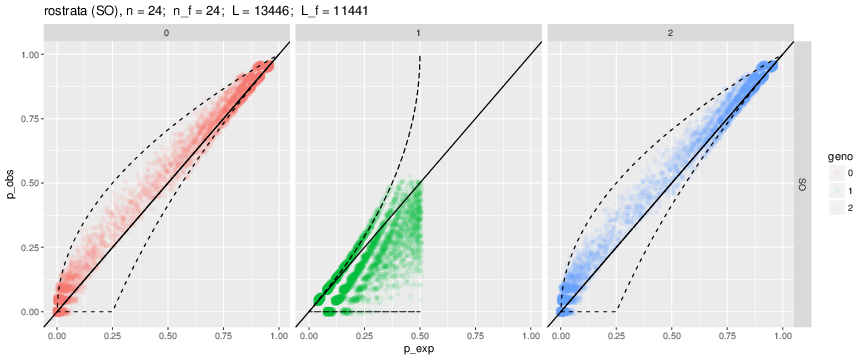


#### lobster,  $m = 0.25$


#### anchovy,  $m = 0.28$

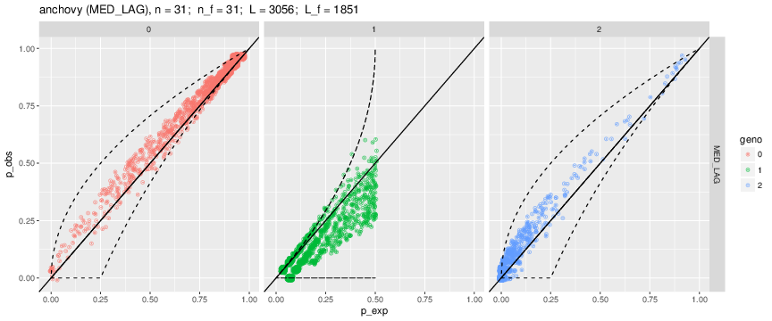


#### snails,  $m = 0.45$


#### chinook_gatk,  $m = 0.50$

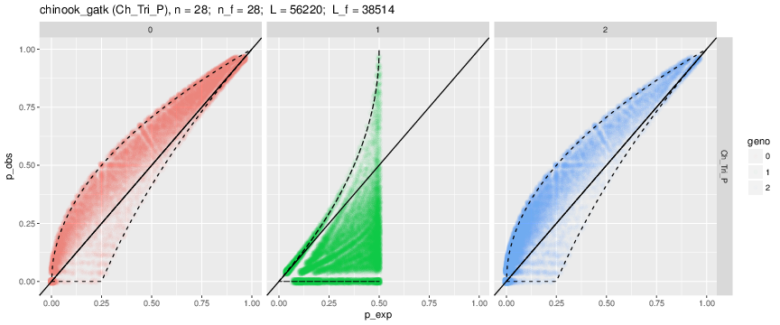


#### dolphin_L_albirostris,  $m = 0.65$

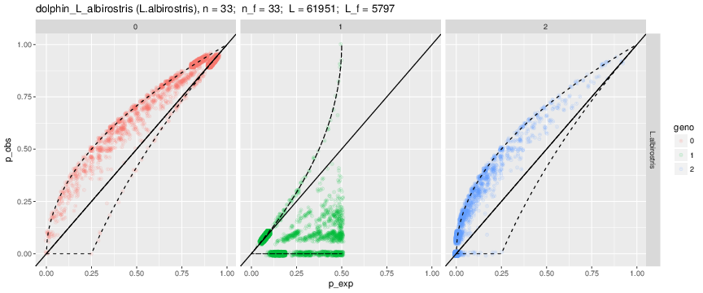


#### dolphin_L_acutus,  $m = 0.72$

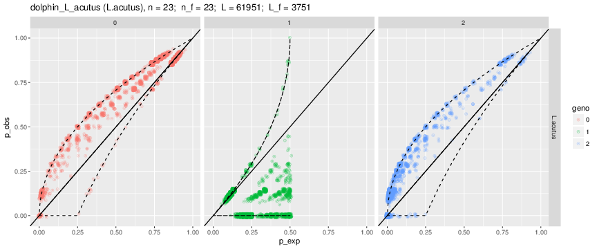


## ANGSD and Low Coverage RAD Data

We just saw evidence of widespread genotyping error in some RAD datasets.  What should
be clear is that not all RAD data sets have inaccurate genotype calls.  But some of them
have really inaccurate genotype calls.  We haven't had time to do a proper analysis
of correlations of the genotyping error rates with sequencing methods and protocols,
so we won't investigate that, here.

However, it is natural to ask whether it seems likely that a program like ANGSD, (which
calls genotypes probabilistically using a model not unlike the one that we
developed in [an earlier section](#probcall)) will be able to ameliorate the 
genotyping error situation we have encountered.

I don't have a whole lot of experience using ANGSD, but I've been involved
in checking some results from a recent paper (Prince et al.) out of Mike Miller's group.  They
used ANGSD for most of their analyses, so we can use their data to see how ANGSD
handles things.

The **chinook_gatk** data set above is actually the Chinook data from Prince et al.
that I ran through the GATK pipeline used for the wifl data set.  It is obvious that 
the data do not carry as much information about genotype as the wifl data.

Alongside the Chinook data, the Prince et al. paper also analyzed (in a very similar fashion)
a data set from steelhead trout.  We can show some ANGSD results from that.

### Forcing ANGSD to Call Genotypes

ANGSD does not like to call genotypes.  It prefers to compute genotype posteriors
and then carry those to the downstream analyses.  However, you can force it to call
genotypes and then submit those to an analysis to estimate $m$ like we did above.

I've done that for the steelhead data, using parameter settings identical to those
used by Prince et al. for their PCA analysis.

Here is what it looks like when we do that:

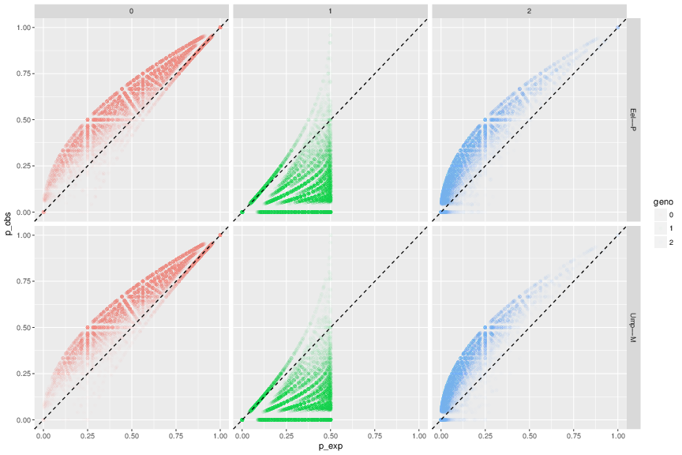

The two populations above had the highest average number of individuals with called
genotypes out of all the sampling locations.  

When we throw these data into our $m$-estimation function we get:

Population    | Estimated $m$ 
-----------   | --------------
Eel Premature | 0.66
Umpqua Mature | 0.69

That is quite poor.  But note that for the PCA, Prince et al used a _uniform prior_ on
genotypes (meaning that, _a priori_, each of the three genotypes has the same 
probability).  This type of model in ANGSD does **not** use the estimated allele frequency
to provide a model for genotype frequencies.  So, we should not be surprised that it performed
so poorly in providing inferred genotypes.  

However, it is worth noting that if you are inferring a lot of genotypes from a lot of
different populations, this prior makes more sense than the allele frequency prior.

### ANGSD with the Allele Freq Prior for Genotypes

We get a very different picture when we apply a model for the genotypes that makes use of the
allele frequencies and assumes that genotypes should occur in Hardy-Weinberg proportions.  In 
that case, here are what the observed versus expected genotype frequencies plot looks like:

#### Umpqua Mature

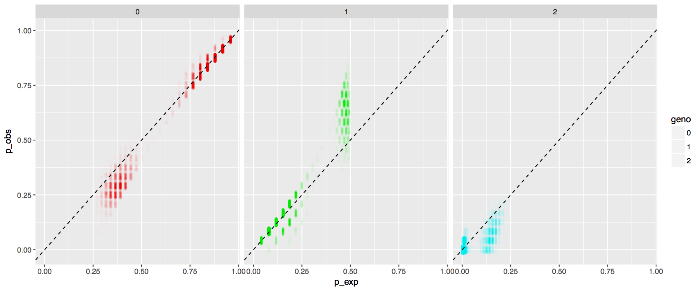


#### Eel Premature

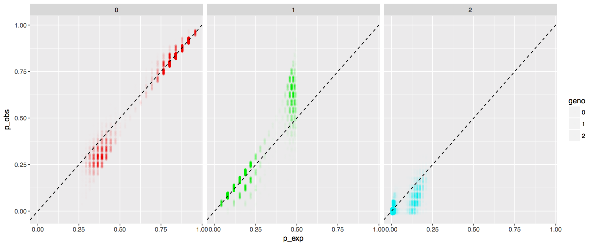

That looks better than it does with the uniform prior, but it doesn't really look
that good.  It certainly doesn't look like what you would expect.  

What are the consequences of this? It seems reasonable that there are a number
of analyses that might be affected by unreliable inference of genotypes...and some
that probably are not.  That would be a good discussion item...

### Subsampling Reads to Before Feeding them into ANGSD?

Disclaimer here: I am not an expert at using ANGSD, but I have applied it a few times.
Most recently I used it to reproduce a lot of the work in the recent Prince et al. 
paper.  One of the things that intrigued me (as a statistician) was their practice
of randomly subsampling aligned, filtered reads out of their BAM files for each individual before
analyzing the data with ANGSD.  This was done, apparently, "To remove variation associated
with variable sequencing depth."" (I'm not sure how that is supposed to work.  The models are such that
even if you have a lot of reads from one individual, that individual will never be granted
more than one genotypes' worth of information at a locus).

For most of their analyses, they only used 60,000 alignments from Chinook and 
120,000 from _mykiss_.  Here is a plot that shows where those numbers are relative
to the distribution of number of reads across individuals.  The black vertical lines are
at 60K and 120K for Chinook and Steelhead, respectively.

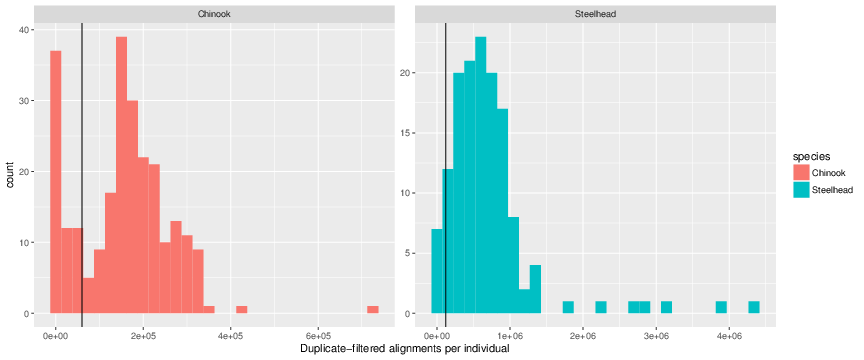

Holy Moly!  That is a lot of data that is getting thrown away.  (By subsampling these
BAMs, they are effectively
tossing out $\approx$70% of the total number of alignmnents).


That can't be good, can it? 

### A PCA of Willow Flycatchers

I was able to assess this (a little bit) by using Kristen's Willow Flycatcher data.
When I perform a PCA using her data run through her GATK pipeline (using all the reads left after
alignment and filtering of PCR duplicates) we get quite strong separation
between the different subspecies of WIFLs and also some evidence of geographic
structuring within the subspecies:

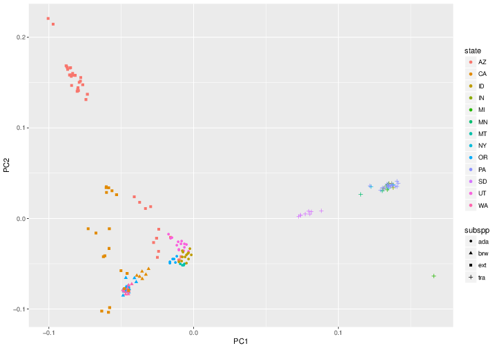

### A PCA when We Subsample to 120K Reads and Use ANGSD/ngsTools

However, we can take the same data set and ask, "What would this look like if Kristen
were not super diligent in getting high read depths from high quality DNA, and so, instead, 
she got much lower read depths and chose to run her data through ANGSD while subsampling her
BAMs to 120K reads?"

This is done by simply subsampling the BAMs to 120K reads and using ngsCovar to perform the 
PCA.  Here is what that looks like:

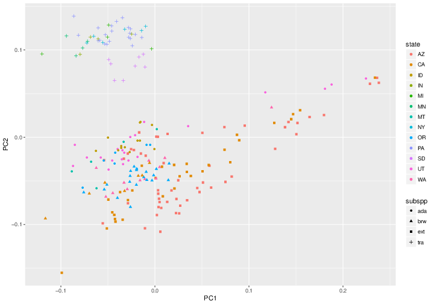

Hmm...the _trailii_ subspecies shows up as a clearly distinct cluster, but there is only limited
separation between the remaining subspecies.  The picture is not quite so clear as it is with all
the data, it doesn't accord well with subspecies designations and geographic structuring, and it
is much harder to identify misidentified samples, etc.  

Given this, I think that a good discussion topic for the week might be to explore
how far one ought (or oughtn't) go in targeting low numbers of
reads, subsampling them even further, and then believing that it
should all be OK because one is
going to call genotypes probabilistically.  

## Wrap Up

Key Take Home Messages:

1. To the Bayesian, probability is how we measure uncertainty.  
2. The posterior is proportional to the prior times the likelihood.
3. Monte Carlo sampling from a posterior distribution makes it very easy to assess the
posterior distribution of any function of the samples.
4. MCMC is useful to Bayesians because it can simulate from the posterior without needing
to compute the normalizing constant.
5. MCMC is great, but should be used with care.
6. In their essence, models for calling genotypes probabilistically while estimating and
accounting for allele frequencies are quite simple, and make a lot of sense.
7. There are a lot of RAD/GBS-derived data sets of genotypes that show evidence
of profoundly high rates of heterozygotes being miscalled as homozygotes. It doesn't seem
out of the question that such error rates could influence downstream inferences.
8. However, not all studies show very high genotyping error rates---high read depths and
intelligent/stringent filtering can prevail.
9. Probabilistic genotype calling is certainly a principled way to address these issues,
but it is not a panacea.  It still adheres to the principles of GIGO and can't make something
from nothing. 
10. Don't fool yourself into thinking that by using probabilistic genotype calling
you won't lose anything when you shave sequencing effort down to as little as possible.  
It looks like it is possible to
lose a fair bit when you go down to low read depth / coverage.  Doing so
in the context of whole-genome sequencing makes sense, it is worth discussing whether
doing RAD seq and then throwing away a lot of your reads and read depth makes
much sense.


## Old Stuff Put at the End For Now


